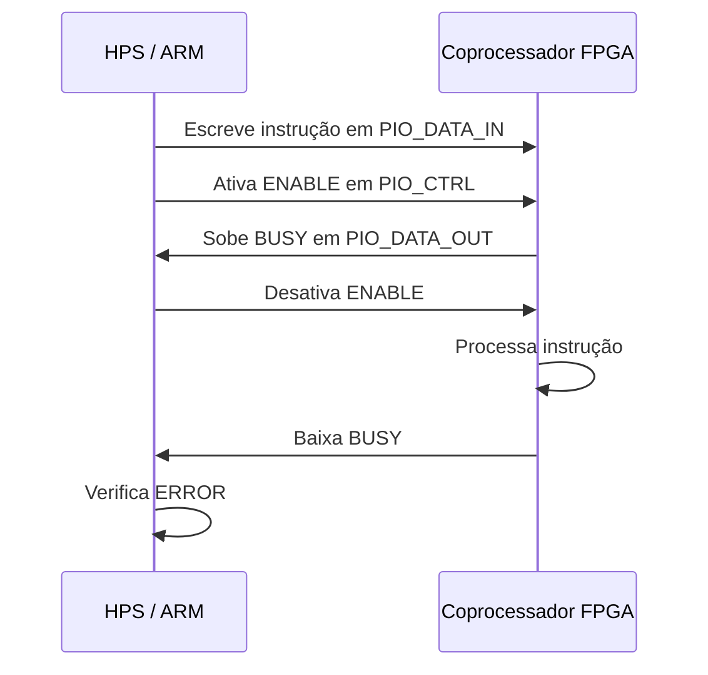
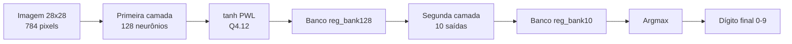

# 🚀 Marco 2 — Driver Linux em Assembly ARM + Coprocessador ELM na DE1-SoC

> Projeto do **Marco 2** da disciplina **TEC 499 — MI Sistemas Digitais**, com integração entre o **HPS ARM Cortex-A9** da placa **DE1-SoC** e um **coprocessador neural em FPGA**, usando comunicação **MMIO** pela **Lightweight HPS-to-FPGA Bridge**.

<p align="center">
  
  
  
  
  
  
</p>

---

## 📌 Sumário

- [📖 Sobre o Projeto](#-sobre-o-projeto)
- [🎯 Objetivo do Marco 2](#-objetivo-do-marco-2)
- [🧠 Visão Geral da Arquitetura](#-visão-geral-da-arquitetura)
- [📂 Estrutura do Repositório](#-estrutura-do-repositório)
- [🔌 Mapa de Registradores MMIO](#-mapa-de-registradores-mmio)
- [🤝 Protocolo de Handshake MMIO](#-protocolo-de-handshake-mmio)
- [🧾 Formato das Instruções](#-formato-das-instruções)
- [🛠️ Driver em Assembly ARM](#️-driver-em-assembly-arm)
- [🧩 API Pública do Driver](#-api-pública-do-driver)
- [⚙️ Coprocessador em Verilog](#️-coprocessador-em-verilog)
- [🧮 Rede Neural Implementada](#-rede-neural-implementada)
- [📊 Benchmark e Métricas](#-benchmark-e-métricas)
- [▶️ Como Compilar e Executar](#️-como-compilar-e-executar)
- [🖼️ Como Trocar a Imagem de Teste](#️-como-trocar-a-imagem-de-teste)
- [🧪 Saída Esperada](#-saída-esperada)
- [🚨 Tabela de Erros e Soluções](#-tabela-de-erros-e-soluções)
- [✅ Checklist de Entrega](#-checklist-de-entrega)
- [🏁 Conclusão](#-conclusão)

---

## 📖 Sobre o Projeto

Este projeto implementa um sistema embarcado para **classificação de dígitos numéricos** usando uma rede neural do tipo **ELM — Extreme Learning Machine** acelerada em hardware.

A aplicação roda no **Linux do HPS** da DE1-SoC e se comunica com o hardware da FPGA por meio de **registradores mapeados em memória**. O diferencial do projeto é que a camada de comunicação com a FPGA foi implementada em **Assembly ARM**, enquanto o coprocessador foi implementado em **Verilog**.

Em termos simples:

```text
Aplicação C  →  Driver Assembly ARM  →  MMIO  →  PIOs  →  Coprocessador ELM em Verilog
```

---

## 🎯 Objetivo do Marco 2

O Marco 2 tem como objetivo demonstrar a integração real entre software e hardware na DE1-SoC.

| Objetivo | Como foi feito no projeto |
|---|---|
| Inicializar a FPGA pelo Linux | `open("/dev/mem")` + `mmap()` em Assembly |
| Enviar dados para o coprocessador | Escrita em `PIO_DATA_IN` via MMIO |
| Controlar a execução | Bits de controle em `PIO_CTRL` |
| Aguardar resposta da FPGA | Polling dos bits `BUSY`, `DONE` e `ERROR` |
| Executar inferência | Opcode `OP_START` enviado ao coprocessador |
| Ler o resultado | Bits `[3:0]` de `PIO_DATA_OUT` |
| Medir desempenho | `clock_gettime(CLOCK_MONOTONIC)` no `main.c` |

---

## 🧠 Visão Geral da Arquitetura

```mermaid
graph TD
    A[main.c<br>Benchmark e fluxo principal] --> B[driver.h<br>API pública]
    B --> C[rotinas.s<br>open, mmap, reset e finalização]
    B --> D[instrucoes.s<br>envio de dados e handshake]
    C --> E[/dev/mem]
    D --> F[Lightweight HPS-to-FPGA Bridge<br>Base física 0xFF200000]
    F --> G[PIO_DATA_IN<br>0x00]
    F --> H[PIO_DATA_OUT<br>0x10]
    F --> I[PIO_CTRL<br>0x20]
    G --> J[Coprocessador ELM<br>Verilog]
    I --> J
    J --> H
```

A arquitetura foi dividida de forma limpa:

| Camada | Arquivos principais | Responsabilidade |
|---|---|---|
| Aplicação | `driver/main.c` | Executa o benchmark, chama a API e calcula métricas |
| Interface pública | `driver/driver.h` | Declara as funções chamadas pelo C |
| Ciclo de vida | `driver/rotinas.s` | Abre `/dev/mem`, faz `mmap`, reseta e finaliza |
| Comunicação | `driver/instrucoes.s` | Envia bias, beta, pesos, imagem e inicia inferência |
| Hardware | `coprocessador/*.v` | Implementa a rede neural e a lógica de controle |
| Dados | `driver/data/` | Contém pesos, bias, beta e imagens em `.bin` |

---

## 📂 Estrutura do Repositório

```text
marco2pbl-main/
├── README.md
├── arquivos/
│   ├── W_in_q.hex / .mif / .txt
│   ├── b_q.hex / .mif / .txt
│   ├── beta_q.hex / .mif / .txt
│   └── mnist_png/
│       ├── create_img.py
│       ├── imagem_2.mif
│       ├── train/
│       └── test/
├── coprocessador/
│   ├── CoProcessor.v
│   ├── neural_unit.v
│   ├── first_layer.v
│   ├── second_layer.v
│   ├── argmax_iterativo.v
│   ├── lsu_controller.v
│   ├── tanh_pwl_q4_12.v
│   ├── reg_bank10.v
│   ├── reg_bank128.v
│   ├── display_resultado.v
│   ├── ghrd_top.v
│   ├── soc_system.qsys
│   ├── soc_system.qpf
│   ├── soc_system.qsf
│   └── output_files/soc_system.sof
└── driver/
    ├── Makefile
    ├── main.c
    ├── driver.h
    ├── rotinas.s
    ├── instrucoes.s
    └── data/
        ├── W_in_q.bin
        ├── b_q.bin
        ├── beta_q.bin
        └── imagens/
            ├── imagem0.bin
            ├── imagem1.bin
            ├── ...
            └── imagem9.bin
```

### Arquivos mais importantes

| Arquivo | Função no projeto |
|---|---|
| `driver/main.c` | Programa principal. Inicializa a FPGA, envia os dados, roda 1000 inferências e imprime métricas |
| `driver/driver.h` | Cabeçalho com a API pública do driver |
| `driver/rotinas.s` | Rotinas Assembly para abrir `/dev/mem`, mapear a bridge e limpar a FPGA |
| `driver/instrucoes.s` | Rotinas Assembly que enviam instruções e dados para o coprocessador |
| `driver/Makefile` | Compila `main.c`, `rotinas.s` e `instrucoes.s` no executável `inferencia` |
| `coprocessador/CoProcessor.v` | Módulo principal do coprocessador, responsável por decodificar instruções e controlar a execução |
| `coprocessador/neural_unit.v` | Unidade de inferência neural: primeira camada, segunda camada e argmax |
| `coprocessador/lsu_controller.v` | Controlador de memória usado para imagem, pesos, bias e beta |
| `coprocessador/ghrd_top.v` | Top-level do projeto Quartus, conectando HPS, PIOs e coprocessador |
| `coprocessador/soc_system.qsys` | Sistema Platform Designer com HPS e PIOs |

---

## 🔌 Mapa de Registradores MMIO

A comunicação usa a **Lightweight HPS-to-FPGA Bridge**, mapeada no endereço físico:

```c
0xFF200000
```

No Assembly, esse endereço é mapeado com:

```asm
.equ BRIDGE_ENDERECO_FISICO, 0xFF200000
.equ BRIDGE_TAMANHO,         0x00005000
```

### Registradores usados

| Registrador | Offset | Direção | Largura | Função |
|---|---:|---|---:|---|
| `PIO_DATA_IN` | `0x00` | HPS → FPGA | 32 bits | Recebe a instrução montada pelo driver |
| `PIO_DATA_OUT` | `0x10` | FPGA → HPS | 32 bits | Retorna resultado e flags de status |
| `PIO_CTRL` | `0x20` | HPS → FPGA | 3 bits | Controla `ENABLE`, `CLEAR` e `RESET` |

### Bits do `PIO_CTRL`

| Bit | Nome | Valor no Assembly | Significado |
|---:|---|---:|---|
| `CTRL[0]` | `ENABLE` | `1` | Avisa a FPGA que existe uma instrução nova em `PIO_DATA_IN` |
| `CTRL[1]` | `CLEAR` | `2` | Limpa flags residuais, como `DONE` e `ERROR` |
| `CTRL[2]` | `RESET` | `4` | Reinicia a lógica interna do coprocessador |

No `ghrd_top.v`, esses sinais são conectados assim:

```verilog
assign enable_coprocessador = CTRL[0];
assign clear_coprocessador  = CTRL[1];
assign rst_coprocessador    = CTRL[2] | ~hps_fpga_reset_n;
```

### Bits do `PIO_DATA_OUT`

| Bits | Nome | Máscara | Significado |
|---:|---|---:|---|
| `[3:0]` | Resultado | `0x0F` | Dígito classificado pela rede, de 0 a 9 |
| `[4]` | `DONE` | `0x10` | Indica que a operação/inferência terminou |
| `[5]` | `BUSY` | `0x20` | Indica que a FPGA recebeu ou está processando uma instrução |
| `[6]` | `ERROR` | `0x40` | Indica erro interno ou instrução inválida |

No `CoProcessor.v`, a saída é montada assim:

```verilog
assign data_out = { 25'b0, fl_error, fl_processor_busy, fl_processor_done, predicted_digit_register };
```

---

## 🤝 Protocolo de Handshake MMIO

O handshake é o “aperto de mão” entre o processador ARM e a FPGA. Ele impede que o HPS envie dados rápido demais e garante que o coprocessador realmente recebeu cada instrução.

### Fluxo do handshake



### Etapas executadas em `enviar_instrucao`

| Etapa | Ação | Assembly equivalente |
|---:|---|---|
| 1 | Escreve a instrução de 32 bits | `STR R0, [R6, #PIO_DATA_IN]` |
| 2 | Ativa o sinal `ENABLE` | `STR #CTRL_ENABLE, [R6, #PIO_CTRL]` |
| 3 | Espera `BUSY = 1` | `TST R2, #STATUS_BUSY` + `BNE` |
| 4 | Desativa `ENABLE` | `STR #0, [R6, #PIO_CTRL]` |
| 5 | Espera `BUSY = 0` | `TST R2, #STATUS_BUSY` + `BEQ` |
| 6 | Verifica erro | `TST R2, #STATUS_ERROR` |

### Códigos de retorno do handshake

| Retorno | Significado |
|---:|---|
| `0` | Instrução enviada e processada com sucesso |
| `-3` | A FPGA sinalizou `STATUS_ERROR` |
| `-99` | Timeout esperando o handshake |

---

## 🧾 Formato das Instruções

Cada comando enviado ao coprocessador é uma palavra de **32 bits**. Os **3 bits menos significativos** indicam o opcode, e os demais bits carregam endereço, índice ou valor.

### Opcodes

| Opcode | Nome no Assembly | Função |
|---:|---|---|
| `0` | `OP_STORE_IMAGE` | Armazena um pixel da imagem |
| `1` | `OP_STORE_WEIGHT_ADDR` | Envia o endereço do peso que será escrito |
| `2` | `OP_STORE_WEIGHT_VALUE` | Envia o valor do peso para o endereço selecionado |
| `3` | `OP_STORE_BIAS` | Armazena um valor de bias |
| `4` | `OP_STORE_BETA` | Armazena um valor de beta |
| `5` | `OP_START` | Inicia a inferência |

### Formatos de instrução

| Função | Quantidade | Formato da palavra enviada |
|---|---:|---|
| `enviar_imagem()` | 784 pixels | `[20:13] pixel` + `[12:3] índice` + `[2:0] opcode 0` |
| `enviar_bias()` | 128 valores | `[25:10] valor Q4.12` + `[9:3] índice` + `[2:0] opcode 3` |
| `enviar_beta()` | 1280 valores | `[29:14] valor Q4.12` + `[13:3] índice` + `[2:0] opcode 4` |
| `enviar_pesos()` | 100352 pesos | Usa duas instruções: endereço com opcode 1 e valor com opcode 2 |
| `inferencia()` | 1 comando | Envia `OP_START` e aguarda `DONE` |
| `ler_resultado()` | 1 leitura | Lê `PIO_DATA_OUT` e aplica máscara `0x0F` |

### Formato Q4.12

Os pesos, bias e beta usam ponto fixo **Q4.12**, ou seja:

| Parte | Bits | Descrição |
|---|---:|---|
| Inteira + sinal | 4 bits | Representa a parte inteira com sinal |
| Fracionária | 12 bits | Representa a precisão decimal |
| Total | 16 bits | Valor usado pela rede neural |

No driver, os dados são lidos dos `.bin` e convertidos de endianess com:

```asm
REV  R7, R7
ASR  R7, R7, #16
UXTH R7, R7
```

---

## 🛠️ Driver em Assembly ARM

O driver foi dividido em dois arquivos Assembly para separar responsabilidades.

### `rotinas.s` — ciclo de vida da conexão

| Função | O que faz |
|---|---|
| `inicializar_fpga()` | Abre `/dev/mem`, mapeia a bridge com `mmap()` e salva o ponteiro base |
| `reset_clean_fpga()` | Pulsa `RESET` e `CLEAR` para colocar o hardware em estado limpo |
| `finalizar_fpga()` | Executa `munmap()`, fecha `/dev/mem` e zera as variáveis globais |

### `instrucoes.s` — comunicação com o coprocessador

| Função | O que faz |
|---|---|
| `enviar_instrucao` | Função interna que implementa o handshake MMIO |
| `enviar_bias()` | Envia 128 valores de bias para a FPGA |
| `enviar_beta()` | Envia 1280 valores de beta para a FPGA |
| `enviar_pesos()` | Envia 100352 pesos usando endereço + valor |
| `enviar_imagem()` | Envia 784 pixels de uma imagem 28×28 |
| `inferencia()` | Limpa flags, envia `START` e aguarda `DONE` |
| `ler_resultado()` | Retorna o dígito classificado nos bits `[3:0]` |

### Variáveis globais compartilhadas

| Variável | Onde fica | Função |
|---|---|---|
| `fd_devmem` | `rotinas.s` | Guarda o descritor de arquivo de `/dev/mem` |
| `base_virtual` | `rotinas.s` | Guarda o endereço virtual retornado por `mmap()` |

---

## 🧩 API Pública do Driver

A aplicação C não chama as rotinas Assembly diretamente pelo nome dos arquivos. Ela inclui `driver.h`, que expõe a API pública.

```c
void *inicializar_fpga(void);
void  finalizar_fpga(void);
void  reset_clean_fpga(void);

int enviar_bias(void);
int enviar_beta(void);
int enviar_pesos(void);
int enviar_imagem(void);
int inferencia(void);
int ler_resultado(void);
```

### Tabela da API

| Função | Retorno | Descrição |
|---|---|---|
| `inicializar_fpga()` | Ponteiro ou `NULL` | Mapeia a bridge da FPGA no espaço virtual do Linux |
| `finalizar_fpga()` | `void` | Libera o mapeamento e fecha `/dev/mem` |
| `reset_clean_fpga()` | `void` | Reinicia e limpa o coprocessador |
| `enviar_bias()` | `0` ou erro | Envia os bias da rede |
| `enviar_beta()` | `0` ou erro | Envia os beta da rede |
| `enviar_pesos()` | `0` ou erro | Envia os pesos da rede |
| `enviar_imagem()` | `0` ou erro | Envia a imagem de entrada |
| `inferencia()` | `0` ou erro | Inicia a inferência e aguarda conclusão |
| `ler_resultado()` | `0` a `9` | Retorna o dígito classificado |

---

## ⚙️ Coprocessador em Verilog

O coprocessador recebe instruções do HPS, grava dados nas memórias internas e executa a inferência neural quando recebe `START`.

### Módulos principais

| Módulo | Função |
|---|---|
| `CoProcessor.v` | Decodifica instruções, controla flags, acessa memórias e inicia a inferência |
| `neural_unit.v` | Controla o fluxo da rede neural: primeira camada, segunda camada e argmax |
| `first_layer.v` | Calcula a primeira camada da rede |
| `second_layer.v` | Calcula a segunda camada da rede |
| `argmax_iterativo.v` | Escolhe o índice com maior pontuação, gerando o dígito final |
| `lsu_controller.v` | Controla acesso a RAMs internas via `altsyncram` |
| `reg_bank128.v` | Banco intermediário com 128 posições |
| `reg_bank10.v` | Banco final com 10 posições, uma para cada dígito |
| `tanh_pwl_q4_12.v` | Aproximação da função `tanh` em ponto fixo Q4.12 |
| `display_resultado.v` | Converte o dígito para display de 7 segmentos |
| `ghrd_top.v` | Conecta o HPS, PIOs e coprocessador no top-level |

### Estados principais do `CoProcessor.v`

| Estado | Função |
|---|---|
| `ST_IDLE` | Aguarda uma nova instrução com `enable = 1` |
| `ST_DECODE` | Decodifica o opcode recebido nos bits `[2:0]` |
| `ST_MEMORY` | Aguarda a escrita/leitura nas memórias internas |
| `ST_INFERENCE` | Aguarda a rede neural terminar a classificação |

---

## 🧮 Rede Neural Implementada

A rede implementada é um classificador de dígitos baseado em **ELM**. Ela recebe uma imagem 28×28, processa os pixels e retorna o dígito mais provável.

### Dimensões dos dados

| Dado | Quantidade | Largura | Arquivo usado pelo driver |
|---|---:|---:|---|
| Imagem | 784 pixels | 8 bits | `driver/data/imagens/imagem4.bin` |
| Pesos `W_in` | 100352 valores | 16 bits Q4.12 | `driver/data/W_in_q.bin` |
| Bias `b` | 128 valores | 16 bits Q4.12 | `driver/data/b_q.bin` |
| Beta | 1280 valores | 16 bits Q4.12 | `driver/data/beta_q.bin` |

### Fluxo da inferência



### Argmax

O módulo `argmax_iterativo.v` percorre as 10 saídas da rede e guarda o índice do maior valor.

| Entrada | Processo | Saída |
|---|---|---|
| 10 pontuações | Compara uma por uma | Dígito com maior pontuação |

---

## 📊 Benchmark e Métricas

O arquivo `main.c` executa o sistema em loop para medir estabilidade e desempenho.

### Fluxo do benchmark

```text
1. inicializar_fpga()
2. reset_clean_fpga()
3. enviar_bias()
4. enviar_beta()
5. enviar_pesos()
6. repetir 1000 vezes:
   6.1 enviar_imagem()
   6.2 inferencia()
   6.3 ler_resultado()
   6.4 calcular latência
7. calcular throughput, acertos e tempo total
8. finalizar_fpga()
```

### Métricas calculadas

| Métrica | Fórmula | Significado |
|---|---|---|
| Execuções válidas | `REPETICOES - falhas` | Quantas inferências terminaram sem erro |
| Latência média | `soma_latencia_ms / execucoes_validas` | Tempo médio de uma inferência |
| Throughput | `execucoes_validas / (tempo_total_ms / 1000)` | Inferências por segundo |
| Porcentagem de acertos | `(acertos / execucoes_validas) * 100` | Percentual de resultados válidos |
| Tempo total | `fim_total - inicio_total` | Duração completa do benchmark |

A medição usa:

```c
clock_gettime(CLOCK_MONOTONIC, &tempo);
```

---

## ▶️ Como Compilar e Executar

### 1. Entre na pasta do driver

```bash
cd driver
```

### 2. Limpe compilações antigas

```bash
make clean
```

### 3. Compile o projeto

```bash
make
```

O Makefile gera o executável:

```bash
./inferencia
```

### 4. Execute com permissão de superusuário

Como o programa acessa `/dev/mem`, é necessário usar `sudo`:

```bash
sudo ./inferencia
```

Ou diretamente:

```bash
make run
```

### Comando completo

```bash
cd driver
make clean
make
sudo ./inferencia
```

---

## 🖼️ Como Trocar a Imagem de Teste

O arquivo usado atualmente está definido em `driver/instrucoes.s`:

```asm
imagem_bin:
    .incbin "data/imagens/imagem4.bin"
```

Para testar outro dígito, troque o nome do arquivo:

```asm
.incbin "data/imagens/imagem7.bin"
```

Depois recompile:

```bash
make clean
make
sudo ./inferencia
```

### Imagens disponíveis

| Arquivo | Dígito esperado |
|---|---:|
| `imagem0.bin` | 0 |
| `imagem1.bin` | 1 |
| `imagem2.bin` | 2 |
| `imagem3.bin` | 3 |
| `imagem4.bin` | 4 |
| `imagem5.bin` | 5 |
| `imagem6.bin` | 6 |
| `imagem7.bin` | 7 |
| `imagem8.bin` | 8 |
| `imagem9.bin` | 9 |

---

## 🧪 Saída Esperada

A saída pode variar em tempo, latência e throughput, mas o formato esperado é:

```text
-------------- Resultados --------------
Digito identificado : 4
Repeticoes              : 1000
Execucoes validas       : 1000
Falhas                  : 0
Porcentagem de Acertos  : 100.0%
Throughput              : XX.XX inf/s
Latencia media          : X.XXX ms
Tempo total             : XXXX.XXX ms
```

---

## 🚨 Tabela de Erros e Soluções

| Erro/Sintoma | Possível causa | Solução recomendada |
|---|---|---|
| `ERRO: falha ao inicializar FPGA` | Sem permissão para acessar `/dev/mem` | Execute com `sudo` |
| `No such file or directory: ./inferencia` | Executável ainda não foi gerado | Rode `make` dentro da pasta `driver` |
| `Clock skew detected` | Data/hora dos arquivos está no futuro | Use `touch *` ou ajuste o relógio do sistema |
| Resultado sempre igual | Imagem, pesos ou endianess podem estar incorretos | Verifique `.incbin`, arquivos `.bin` e conversão `REV/ASR/UXTH` |
| Timeout `-99` | FPGA não levantou/baixou `BUSY` no handshake | Verifique PIOs, `ENABLE`, `BUSY` e conexões no `ghrd_top.v` |
| Timeout `-2` | Inferência não terminou com `DONE` | Verifique FSM da rede neural e sinal `inference_done` |
| Erro `-3` | FPGA sinalizou `STATUS_ERROR` | Verifique opcode e limites de índice no `CoProcessor.v` |
| `Falhas > 0` | Comunicação instável ou timeout | Teste SignalTap, confira endereços e status flags |

---

## ✅ Checklist de Entrega

- [x] Driver em Assembly ARM separado em `rotinas.s` e `instrucoes.s`
- [x] API pública documentada em `driver.h`
- [x] Aplicação C com benchmark em `main.c`
- [x] Comunicação via `/dev/mem` + `mmap()`
- [x] Uso da Lightweight HPS-to-FPGA Bridge em `0xFF200000`
- [x] PIOs de entrada, saída e controle configurados no Platform Designer
- [x] Protocolo MMIO com `ENABLE`, `BUSY`, `DONE` e `ERROR`
- [x] Timeouts para evitar travamento infinito
- [x] Envio de imagem, pesos, bias e beta
- [x] Inferência por hardware no coprocessador Verilog
- [x] Resultado lido pelo HPS via `PIO_DATA_OUT`
- [x] Métricas de latência, throughput, falhas e acertos
- [x] Makefile para compilação simples

---

## 🏁 Conclusão

Este projeto demonstra uma integração completa entre **software embarcado Linux** e **hardware customizado em FPGA**. O HPS executa a aplicação principal, mas a inferência neural é acelerada por um coprocessador implementado em Verilog.

O ponto mais importante do Marco 2 é que a comunicação não depende de bibliotecas prontas de alto nível: o driver faz o acesso direto à memória física usando `/dev/mem`, `mmap()` e instruções Assembly ARM. Isso mostra domínio sobre:

- comunicação HPS ↔ FPGA;
- registradores MMIO;
- protocolo de handshake;
- programação Assembly ARM;
- controle de hardware em Verilog;
- benchmark de sistemas embarcados;
- integração entre C, Assembly e FPGA.

> Resultado final: um classificador embarcado de dígitos capaz de carregar dados, executar inferência no hardware e reportar métricas de desempenho no Linux da DE1-SoC.

---

<p align="center">
  <strong>Marco 2 — Driver Linux em Assembly ARM para Coprocessador ELM na DE1-SoC</strong><br>
  TEC 499 — MI Sistemas Digitais • UEFS
</p>
